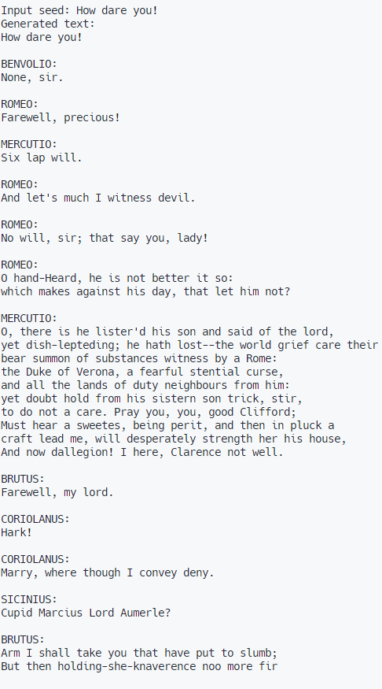

## About

This is a replication with custom modification of Karpahy's tutorial on language models: [Let's build GPT: from scratch, in code, spelled out.](https://youtu.be/kCc8FmEb1nY). Basically a character level decoder gpt-like model.

Author of original content: [@karpathy](https://github.com/karpathy)

Example of model output:



As the result of this little fun-project, two models were trained:

1. `tiny-peare` - basically a single-layer transformer decoder
2. `clank-peare` - a sort-of big transformer decoder (big as much as my gpu can afford)

Both models are trained, as in original lecture, on [tiny_shakespear](https://huggingface.co/datasets/tiny_shakespeare). Models hyperparamters are listed [here](#hyperparameters).

## How to run

To run this, only external library you need installed is `torch`. Assuming that it is, run:

```
git clone https://github.com/shredder67/gpt-playground
cd gpt-playground
```

To test the inference of pretrained model located in models/ folder you have to follow 2-step procedure:

1. Copy listed hyperparamters for model from [here](#hyperparameters) into the section highlited in `main.py` as _Hyperparameters_ (yes, I'm too lazy for that argparse routine 🙂)
2. Run the following command with `model_name.pt` being the file with model weights located in models/ folder

```
python main.py --test_inference model_name.pt
```

If you want to train and save you model, you can run (model name doesn't need extension), it will be saved to models/

```
python main.py --save_model_as model_name
```

To simply train and see sample ouput, run without any arguements.

## Hyperparameters

**tiny.pt**

```
BATCH_SIZE = 32
TRAIN_EPOCH_NUM_STEPS = 1000
TEST_EPOCH_NUM_STEPS = 200
LEARNING_RATE = 3e-3
EMBEDDING_SIZE = 128
BLOCK_SIZE = 128
N_LAYER = 1
NUM_HEADS = 4
DROP_PROB = 0.2
```

**clank.pt**

```
BATCH_SIZE = 64
TRAIN_EPOCH_NUM_STEPS = 5000
TEST_EPOCH_NUM_STEPS = 200
LEARNING_RATE = 3e-4
EMBEDDING_SIZE = 300
BLOCK_SIZE = 400
N_LAYER = 6
NUM_HEADS = 6
DROP_PROB = 0.2
```
